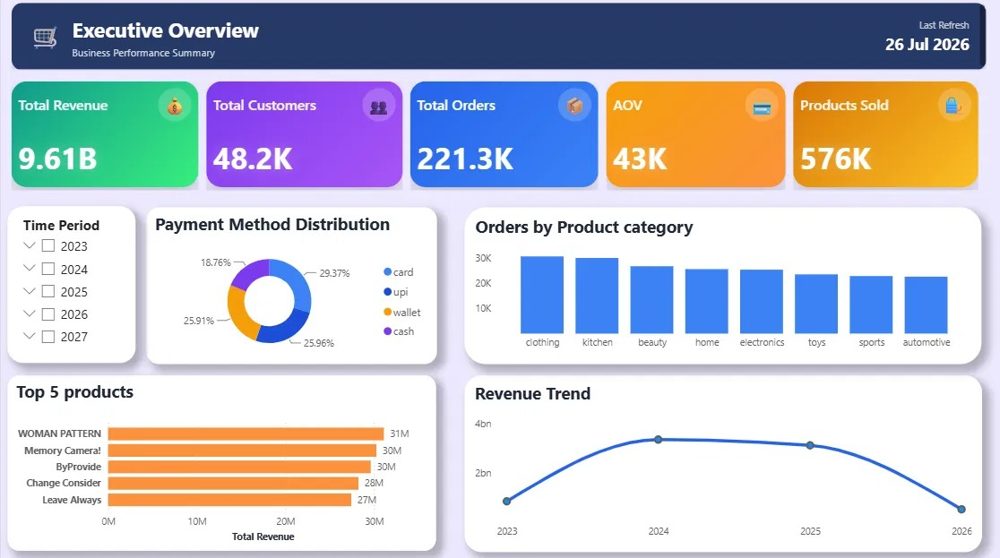
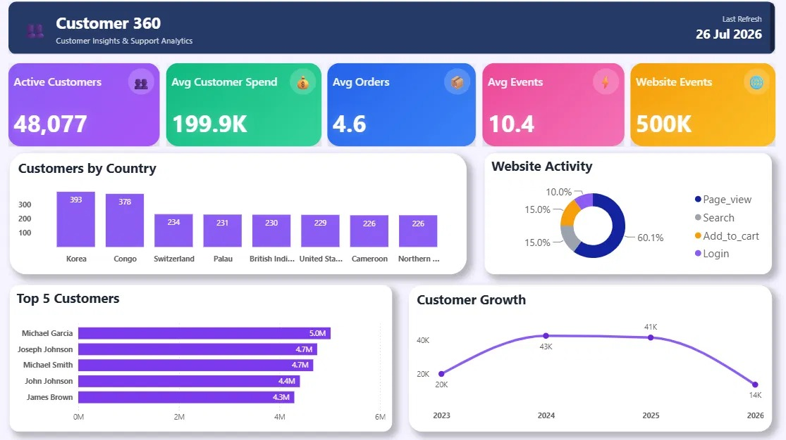
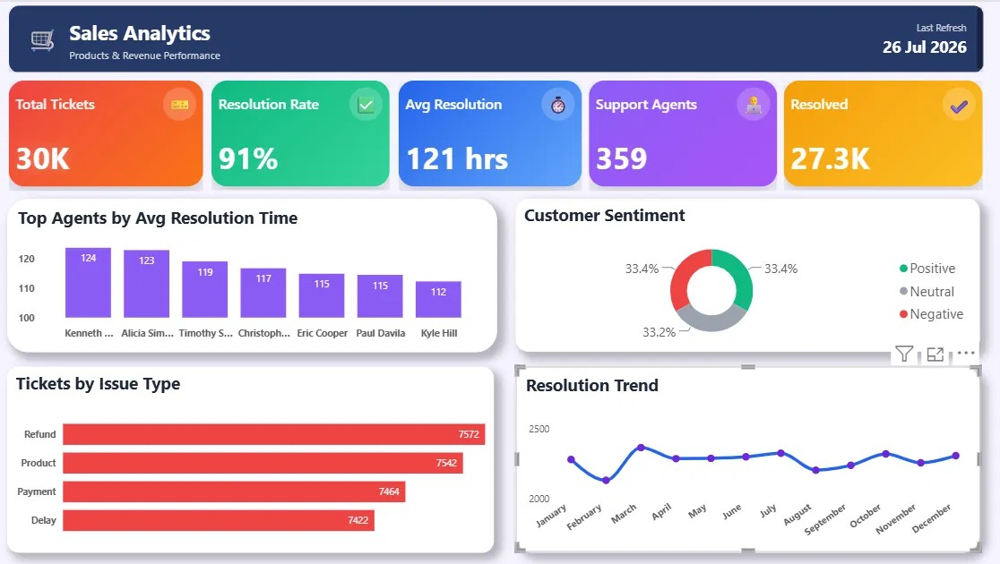
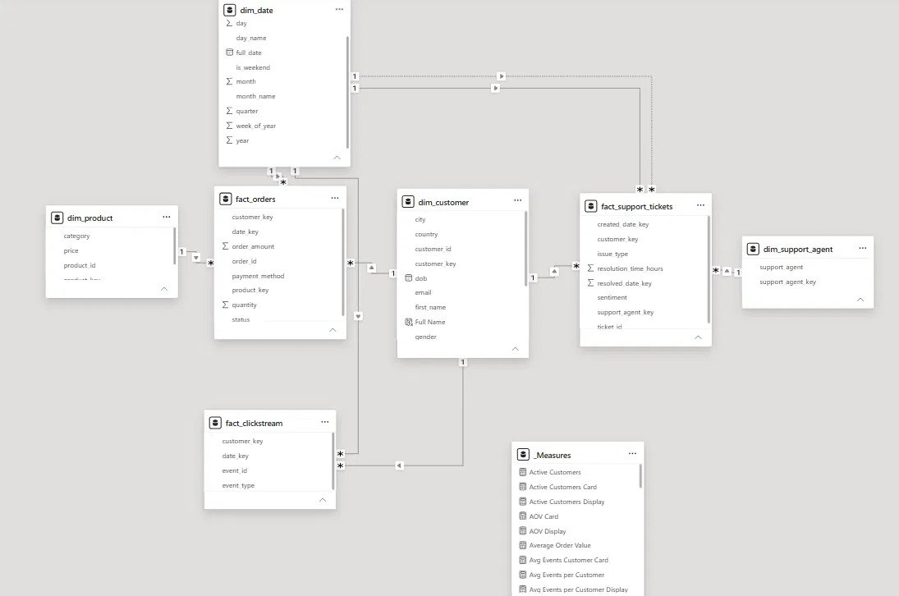
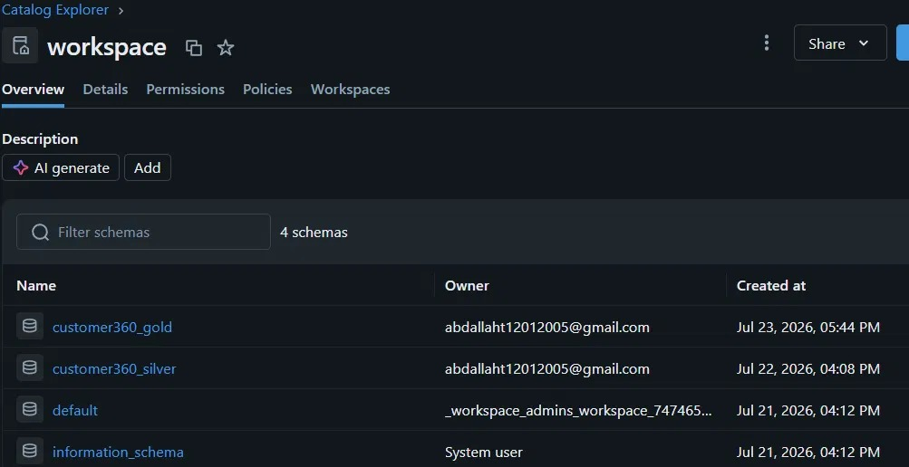

# Customer360 Analytics Platform


---

# Customer360 Analytics Platform

An End-to-End Data Analytics project that transforms raw business data into executive insights using the Medallion Architecture (Bronze → Silver → Gold) with Databricks and Power BI.

---

# Business Problem

Modern businesses generate data from multiple sources including:

- Customers
- Orders
- Products
- Support Tickets
- Website Clickstream

Raw data is often inconsistent, duplicated, incomplete, and difficult to analyze.

The objective of this project is to build a complete analytics pipeline capable of transforming raw operational data into reliable business intelligence dashboards.

---

# Solution

The project follows a modern Lakehouse architecture.

Raw Data

↓

Bronze Layer

↓

Silver Layer

↓

Gold Layer

↓

Power BI Dashboards

---

# Architecture

## Bronze Layer

- Raw Data Ingestion
- No Business Logic
- Original Data Preservation

---

## Silver Layer

- Data Cleaning
- Data Standardization
- Duplicate Removal
- Null Handling
- Business Validation
- Data Quality Rules

---

## Gold Layer

Business-ready analytical tables.

Includes:

- Fact Tables
- Dimension Tables
- Date Dimension
- Star Schema

---

# Technology Stack

- Databricks
- PySpark
- SQL
- Power BI
- DAX
- Star Schema
- Medallion Architecture
- GitHub

---

# Dashboards

## 1. Executive Overview

Provides a high-level business summary including:

- Revenue
- Orders
- Customers
- Products Sold
- Website Events
- Revenue Trend
- Order Trend
- Revenue by Category
- Customer Growth

---

## 2. Customer360 Analytics

Focused on customer behavior.

KPIs include:

- Average Customer Spend
- Average Orders per Customer
- Revenue Distribution
- Customer Segmentation
- Website Activity
- Product Categories

---

## 3. Support Analytics

Customer support performance dashboard.

Includes:

- Resolution Rate
- Average Resolution Time
- Ticket Volume
- Support Agents
- Customer Sentiment
- Issue Types

---

# Business KPIs

- Revenue
- Orders
- Customers
- Products Sold
- Website Events
- Customer Growth
- Average Customer Spend
- Average Orders
- Resolution Rate
- Average Resolution Time
- Customer Sentiment
- Support Performance

---

# Data Model

Star Schema

Fact Tables

- Fact Orders
- Fact Clickstream
- Fact Support Tickets

Dimension Tables

- Dim Customer
- Dim Product
- Dim Support Agent
- Dim Date

---

## Dashboard Preview

### Executive Overview



---

### Customer360 Analytics



---

### Support Analytics



---

### Star Schema



---

### Databricks Workspace


# Repository Structure

```text
Customer360-Analytics-Platform
│
├── screenshots
├── documentation
├── README.md
├── LICENSE
└── .gitignore
```

# Future Improvements

- Incremental Loading
- Delta Live Tables
- CI/CD Deployment
- Automated Data Quality Tests
- Streaming Pipeline

---

# Lessons Learned

During this project I gained practical experience with:

- Building modern Data Pipelines
- Medallion Architecture
- Data Cleaning
- Business Validation
- Star Schema Design
- KPI Development
- Dashboard Storytelling
- End-to-End Analytics Workflow

---

# Author

**Abdallah Tarek**

Data Analyst

LinkedIn:
(Add your LinkedIn)

GitHub:
(Add your GitHub)
